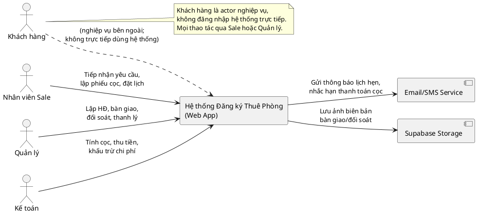
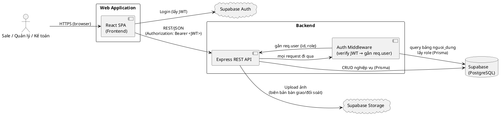
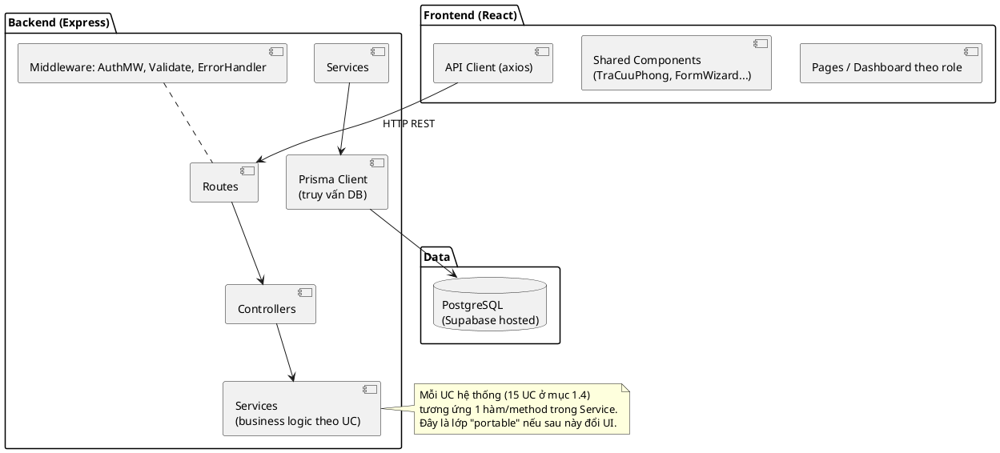

# DESIGN DOCUMENT TỔNG THỂ — Hệ thống Đăng ký Thuê Phòng (Ký túc xá)

> Tài liệu này là cẩm nang theo dõi tiến độ cá nhân, không phải tài liệu nộp.
> Mục tiêu: khi code mà quên hướng đi, mở file này (và các file spec con) để biết bước tiếp theo.

---

## 0. Thông tin chung

- **Loại đồ án:** Cá nhân, môn Phân tích thiết kế hệ thống thông tin (TKPM)
- **Thời gian:** ~1.5 tháng
- **Hướng đi:** Web — React (frontend) + Node.js/Express (backend) + Supabase (PostgreSQL + Auth + Storage)
- **Quy mô:** Đồ án cá nhân, không cần phức tạp hóa — ưu tiên đúng và đủ hơn là "đẹp" hay "scale".
- **Lưu ý convert sang WinForms (nếu cần đổi hướng giữa đường):**
  - Tái dùng được ngay: database schema (đổi cú pháp Postgres → SQL Server), domain model / class diagram mức phân tích, business rules, state machine, đặc tả use-case.
  - Phải viết lại: toàn bộ spec UI (React component) và spec API (REST) — thay bằng spec Form/Service layer tương ứng.
  - → Đây là lý do tài liệu được tách lớp rõ ràng ở mục 3.

---

## 1. Tóm tắt nghiệp vụ (bám theo báo cáo gốc `17_BaoCao-1.pdf`)

### 1.1. Bốn nghiệp vụ chính (Business Use Case)

```
Khách hàng
 ├─ Đăng ký tư vấn & xem phòng       → include: Khảo sát phòng thực tế
 ├─ Đặt cọc xác nhận thuê             → include: Rà soát thông tin & điều kiện thuê
 │                                       → include: Kiểm tra tình trạng phòng/giường
 │                                       → include: Nộp tiền đặt cọc
 │                                       → include: Ghi nhận thông tin đặt cọc
 ├─ Ký thỏa thuận thuê phòng          → include: Kiểm tra điều kiện cư trú
 │                                       → include: Thanh toán kỳ đầu
 │                                       → include: Nhận bàn giao tài sản
 └─ Đăng ký trả phòng                 → include: Đối soát tài sản, hao mòn
                                         → include: Khấu trừ chi phí phát sinh
                                         → include: Thanh lý hợp đồng thuê
```

### 1.2. Vai trò (Actor)

| Vai trò | Trách nhiệm chính |
|---|---|
| **Khách hàng** | Đăng ký nhu cầu, đến xem phòng, xác nhận đặt cọc, ký HĐ, trả phòng |
| **Nhân viên Sale** | Tiếp nhận yêu cầu, đặt lịch xem phòng, rà soát thông tin khách, lập phiếu đặt cọc, ghi nhận cọc, đăng ký trả phòng |
| **Quản lý** | Xác nhận tình trạng phòng/giường, đối chiếu chứng từ cọc, lập hợp đồng thuê, kiểm tra điều kiện cư trú, bàn giao phòng, đối soát tài sản khi trả phòng, cập nhật trạng thái phòng, thanh lý HĐ |
| **Kế toán** | Tính tiền cọc, thu thanh toán kỳ đầu, tính khấu trừ chi phí phát sinh, xác nhận hoàn cọc |

> **Lưu ý:** Khách hàng không trực tiếp thao tác hệ thống — mọi thao tác đều qua Nhân viên Sale hoặc Quản lý. Khách hàng chỉ là actor nghiệp vụ bên ngoài.

### 1.3. State machine — Trạng thái Phòng/Giường

```
                    ┌─────────────────────────────────────────────┐
                    │  timeout 24h không thanh toán cọc           │
                    ▼                                             │
Trống ──[LapPhieuDatCoc]──► Chờ đặt cọc ──[GhiNhanDatCoc]──► Đã đặt cọc ──[BanGiaoPhong]──► Đang thuê ──[ThanhLyHopDong]──► Trống
```

**Enum trạng thái:** `TRONG` | `CHO_DAT_COC` | `DA_DAT_COC` | `DANG_THUE`

> **Business rule quan trọng:** Phòng/giường ở trạng thái `CHO_DAT_COC` hoặc `DA_DAT_COC` **không được hiển thị** trong kết quả tra cứu phòng trống và không được tiếp nhận đặt cọc mới từ khách khác.

### 1.4. 15 Use-case hệ thống (tự động hóa) cần xây dựng

| # | Mã UC | Tên | Actor chính |
|---|---|---|---|
| 1 | `DangNhap` | Đăng nhập | Sale, Quản lý, Kế toán |
| 2 | `TraCuuPhong` | Tra cứu phòng/giường | Sale, Quản lý |
| 3 | `CapNhatTrangThaiPhong` | Cập nhật trạng thái phòng (thủ công) | Quản lý |
| 4 | `TiepNhanYeuCauThue` | Tiếp nhận yêu cầu thuê | Sale |
| 5 | `DatLichXemPhong` | Đặt lịch xem phòng | Sale |
| 6 | `LapPhieuDatCoc` | Lập phiếu đặt cọc + tính tiền cọc | Sale |
| 7 | `GhiNhanDatCoc` | Ghi nhận đặt cọc (sau khi quản lý xác nhận chứng từ) | Sale |
| 8 | `LapHopDongThue` | Lập hợp đồng thuê | Quản lý |
| 9 | `KiemTraDieuKienCuTru` | Kiểm tra điều kiện cư trú | Quản lý |
| 10 | `ThanhToanKyDau` | Thanh toán kỳ đầu | Kế toán |
| 11 | `BanGiaoPhong` | Bàn giao phòng + lập biên bản | Quản lý |
| 12 | `DangKyTraPhong` | Đăng ký trả phòng | Sale |
| 13 | `DoSoatTaiSan` | Đối soát tài sản | Quản lý |
| 14 | `KhauTruChiPhi` | Khấu trừ chi phí phát sinh | Kế toán |
| 15 | `ThanhLyHopDong` | Thanh lý hợp đồng | Quản lý |

> **Lưu ý UC06:** `TinhTienCoc` không phải UC độc lập — được gộp vào `LapPhieuDatCoc`. Công thức: `Tiền cọc = Tiền thuê 2 tháng × Số giường thuê`. Trường hợp thuê nguyên phòng: số giường = sức chứa tối đa của phòng.

> **Lưu ý UC07:** Không có trigger tự động từ UC07 sang UC08. Sau khi cọc xong, Quản lý chủ động vào UC08 khi khách đến nhận phòng theo lịch hẹn.

> Đặc tả chi tiết dòng cơ bản/thay thế của từng UC: xem file `17_BaoCao-1.pdf` gốc (mục 2). Khi code, mở lại file gốc để đối chiếu business rule, **không suy diễn lại từ trí nhớ**.

### 1.5. Domain Model (mức phân tích — đã có hình trong báo cáo gốc)

9 lớp chính: `KhachHang`, `PhieuDatCoc`, `HopDong`, `HoaDon`, `BienBanBanGiao`, `BienBanTraPhong`, `Giuong`, `PhongO`, `ChiNhanh`.

Quan hệ cốt lõi:
- `KhachHang` 1 — 0..* `PhieuDatCoc` (tạo)
- `PhieuDatCoc` 0..1 — 0..1 `HopDong` (dẫn đến — phiếu cọc có thể bị hủy mà không tạo HĐ)
- `HopDong` 1 — 1..* `HoaDon` (phát sinh — nhiều kỳ thanh toán)
- `HopDong` 1 — 1 `BienBanBanGiao` (cọc)
- `HopDong` 1 — 0..1 `BienBanTraPhong` (chỉ tồn tại khi trả phòng)
- `PhongO` 1 — N `Giuong` (thuộc)
- `ChiNhanh` 1 — N `PhongO` (thuộc)

---

## 2. Kiến trúc hệ thống

### 2.1. Lựa chọn công nghệ

| Layer | Công nghệ | Lý do ngắn |
|---|---|---|
| Frontend | React (Vite) + Tailwind | Đã quen, SPA phù hợp dashboard theo role |
| Backend | Node.js + Express | Đã quen, REST API đơn giản, đủ cho đồ án |
| Database | PostgreSQL qua Supabase | Có sẵn Auth + Storage (ảnh biên bản bàn giao), free tier đủ dùng |
| Auth | Supabase Auth (email/password) | Không phải tự viết JWT; role được lưu trong bảng `nguoi_dung` của app |
| ORM | Prisma | Migration có version control, business logic không phụ thuộc Supabase SDK |
| Deploy (nếu cần) | Vercel (FE) + Render/Railway (BE) | Free tier, đủ cho demo |

> **Quyết định kỹ thuật — Auth + Role:**
> - Supabase Auth chỉ xử lý xác thực (email/password → JWT). **Không dùng RLS của Supabase.**
> - Role (`sale` / `quan_ly` / `ke_toan`) được lưu trong bảng `nguoi_dung` của app (Prisma-managed).
> - Auth Middleware của Express: verify JWT từ Supabase, lấy `user_id` → query bảng `nguoi_dung` lấy role → gắn vào `req.user`. Mọi kiểm tra quyền thực hiện ở tầng Service/Controller, không dựa vào RLS.

> **Quyết định kỹ thuật — Hủy cọc 24h:**
> Không dùng cron job (rủi ro sleep trên free tier). Thay bằng **lazy expiry**: mỗi khi có request liên quan đến phiếu đặt cọc (xem, xác nhận, lập HĐ), hệ thống kiểm tra `ngay_tao + 24h < now()`. Nếu quá hạn → tự động hủy phiếu, cập nhật trạng thái phòng về `TRONG` ngay trong cùng transaction đó.

### 2.2. C4 Model — Level 1: System Context



### 2.3. C4 Model — Level 2: Container Diagram



### 2.4. Architecture Diagram (theo lớp)



### 2.5. Convention chung (API)

```
Response thành công:
  { "success": true, "data": { ... } }

Response lỗi:
  { "success": false, "error": { "code": "PHONG_KHONG_TRONG", "message": "Phòng/giường không còn khả dụng" } }

Auth header:
  Authorization: Bearer <supabase_jwt>
```

### 2.6. Cấu trúc thư mục dự kiến

```
project-root/
├── frontend/
│   ├── src/
│   │   ├── pages/              # Dashboard theo role: SaleDashboard, QLDashboard, KTDashboard
│   │   ├── features/           # Theo luồng: dat-coc/, nhan-phong/, tra-phong/, quan-ly-phong/
│   │   ├── components/shared/  # TraCuuPhong, FormWizard, v.v.
│   │   ├── api/                # Lớp gọi REST API (axios)
│   │   └── lib/supabaseClient.js  # Chỉ dùng cho Auth (lấy JWT)
│   └── ...
├── backend/
│   ├── src/
│   │   ├── routes/
│   │   ├── controllers/
│   │   ├── services/           # 1 file ~ 1 nhóm UC (xem mục 1.4)
│   │   ├── middleware/         # authMiddleware.js, validate.js, errorHandler.js
│   │   └── validators/
│   ├── prisma/
│   │   ├── schema.prisma
│   │   └── migrations/
│   └── ...
├── docs/
│   ├── 00_DESIGN_TONG_THE.md   # file này
│   ├── 01_DATABASE_SCHEMA.md
│   ├── 02_API_SPEC.md
│   ├── specs/
│   │   ├── UC01_DangNhap.md
│   │   ├── UC02_TraCuuPhong.md
│   │   └── ... (1 file / UC, tổng 15 file)
│   └── 17_BaoCao-1.pdf         # báo cáo gốc, KHÔNG sửa, chỉ tham khảo
```

---

## 3. Cách tổ chức tài liệu spec (để giữ tính "portable")

Tách rõ 3 tầng tài liệu, không trộn lẫn:

1. **Tầng Domain (`01_DATABASE_SCHEMA.md` + domain model)** — độc lập công nghệ UI. Mô tả bảng, quan hệ, business rule, state machine. Đây là tầng nếu đổi WinForms vẫn giữ nguyên ~90%.
2. **Tầng API/Service (`02_API_SPEC.md` + `specs/UCxx_*.md`)** — mỗi file spec 1 UC, gồm: input, business logic step-by-step (diễn giải lại từ báo cáo gốc), output, error case, endpoint REST tương ứng. Phần "endpoint REST" là phần sẽ đổi nếu sang WinForms (thay bằng "Service method signature"); phần business logic giữ nguyên.
3. **Tầng UI** — không viết spec UI quá chi tiết trước. Chỉ cần file `specs/UCxx_*.md` ghi chú nhanh "màn hình liên quan" để map sang sơ đồ điều hướng khi code.

**Quy ước đặt tên file spec:** `specs/UC<số thứ tự 2 chữ số>_<TenUseCase>.md`, ví dụ `specs/UC06_LapPhieuDatCoc.md`. Số thứ tự theo đúng bảng mục 1.4.

---

## 4. Kế hoạch thực hiện (1.5 tháng ≈ 6 tuần)

> Mục tiêu mỗi tuần là có thể **demo được** phần vừa làm, không dồn hết về cuối.
>
> **MVP tối thiểu (bắt buộc chạy end-to-end):** Nghiệp vụ 1 + 2 (tư vấn → đặt cọc). Nghiệp vụ 3 + 4 có thể demo một phần nếu hết thời gian.

### Tuần 1 — Setup & Database
- [ ] Khởi tạo repo, cấu trúc thư mục (mục 2.6)
- [ ] Setup Supabase project (Auth + Postgres + Storage bucket)
- [ ] Viết `01_DATABASE_SCHEMA.md`: chuyển 9 lớp domain → bảng SQL, định nghĩa enum trạng thái phòng/giường/HĐ
- [ ] Viết `prisma/schema.prisma` + chạy migration đầu tiên
- [ ] Seed dữ liệu mẫu (vài chi nhánh, phòng, giường, tài khoản 3 role)

### Tuần 2 — Backend core: Auth + Tra cứu + Quản lý phòng
- [ ] UC01 `DangNhap` — login qua Supabase Auth, middleware verify JWT + lấy role từ DB
- [ ] UC02 `TraCuuPhong` — API filter theo khu vực/loại/giá/trạng thái (chỉ trả về `TRONG`)
- [ ] UC03 `CapNhatTrangThaiPhong` — API + log lịch sử thay đổi trạng thái
- [ ] Viết spec 3 UC trên trong `specs/`

### Tuần 3 — Luồng Sale: Tiếp nhận → Đặt cọc
- [ ] UC04 `TiepNhanYeuCauThue`, UC05 `DatLichXemPhong`
- [ ] UC06 `LapPhieuDatCoc` — tính tiền cọc, tạo phiếu, chuyển phòng sang `CHO_DAT_COC`, implement lazy expiry 24h
- [ ] UC07 `GhiNhanDatCoc` — xác nhận chứng từ, chuyển phòng sang `DA_DAT_COC`
- [ ] Frontend: Dashboard Sale + form tiếp nhận/đặt cọc

### Tuần 4 — Luồng nhận phòng
- [ ] UC08 `LapHopDongThue`, UC09 `KiemTraDieuKienCuTru`
- [ ] UC10 `ThanhToanKyDau`, UC11 `BanGiaoPhong` (upload ảnh biên bản → Supabase Storage, chuyển phòng sang `DANG_THUE`)
- [ ] Frontend: luồng nhận phòng cho Quản lý/Kế toán

### Tuần 5 — Luồng trả phòng & thanh lý
- [ ] UC12 `DangKyTraPhong`, UC13 `DoSoatTaiSan`
- [ ] UC14 `KhauTruChiPhi` — tính khấu trừ, xác định số tiền hoàn/thu thêm
- [ ] UC15 `ThanhLyHopDong` — cập nhật HĐ "Đã thanh lý", chuyển phòng về `TRONG`
- [ ] Frontend: luồng trả phòng

### Tuần 6 — Hoàn thiện & kiểm thử
- [ ] Dashboard tổng hợp (thống kê nhanh cho mỗi role)
- [ ] Kiểm thử end-to-end toàn bộ 4 nghiệp vụ
- [ ] Sửa lỗi, dọn code, viết README hướng dẫn chạy local
- [ ] (Tùy thời gian) Deploy demo

> **Lưu ý tiến độ:** nếu tới cuối tuần 3 mà chưa xong luồng đặt cọc, cắt giảm ở tuần 5–6 trước (ví dụ: bỏ upload ảnh thật, dùng placeholder URL), **không cắt** ở tuần 1–2 (nền tảng).

---

## 5. Việc cần làm tiếp theo ngay bây giờ

1. Viết `01_DATABASE_SCHEMA.md` — chuyển domain model → bảng cụ thể, kiểu dữ liệu Postgres, enum, index.
2. Viết `02_API_SPEC.md` — danh sách endpoint tổng quan, convention chung (đã ghi sẵn ở mục 2.5).
3. Viết từng file `specs/UCxx_*.md` khi bắt đầu code UC đó — không cần viết hết 15 file trước, viết trước 1–2 tuần so với lúc code để khỏi mất ngữ cảnh.
