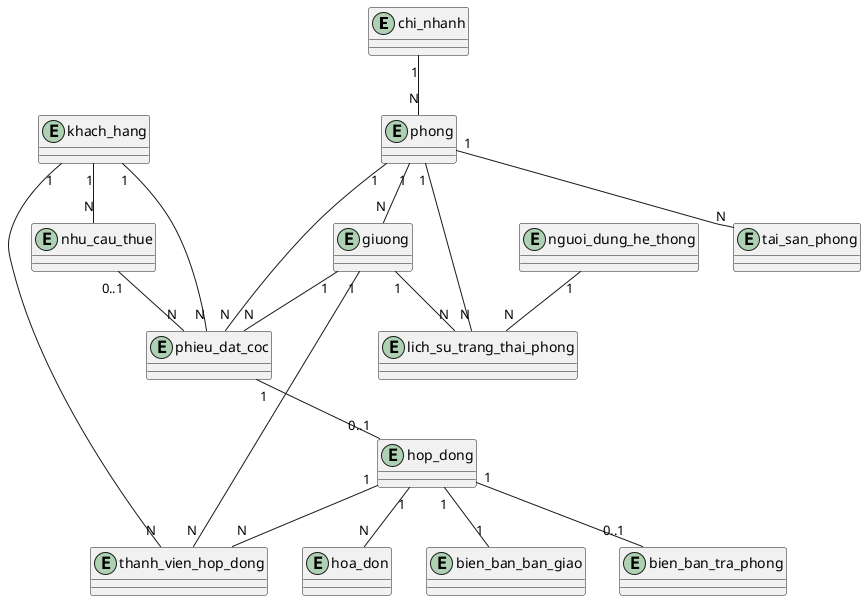

# DATABASE SCHEMA — Hệ thống Đăng ký Thuê Phòng

> Tầng Domain — độc lập với UI/Framework. Nếu sau này đổi từ Web sang WinForms,
> file này (và `prisma/schema.prisma` tương ứng) gần như giữ nguyên, chỉ đổi cú pháp DB nếu đổi từ Postgres sang SQL Server.
> Nguồn tham khảo: class diagram mức phân tích trong `17_BaoCao-1.pdf` + đặc tả nghiệp vụ 15 UC hệ thống.

---

## 1. Quy ước chung

- Khóa chính: `id` kiểu `UUID` (dùng `gen_random_uuid()`), thay cho mã dạng `maKH`, `maPhong`... trong báo cáo gốc để tránh đụng độ khi sinh thủ công. Cột `ma_*` (mã hiển thị, ví dụ `MAKH0001`) giữ làm cột phụ, có thể tự sinh hoặc bỏ qua nếu không cần thiết cho đồ án.
- Tên bảng/cột: `snake_case`, giữ số ít theo thực thể tiếng Việt để dễ đối chiếu báo cáo.
- Mọi bảng có `created_at`, `updated_at` (`timestamptz`, default `now()`).
- Tiền tệ: kiểu `numeric(12,2)` (VNĐ — numeric an toàn hơn float).
- Ngày giờ: `timestamptz`.
- Enum trạng thái dùng kiểu Postgres `ENUM` để ràng buộc giá trị hợp lệ ngay tại DB — **không dùng varchar cho trạng thái**.

---

## 2. Danh sách bảng

Ánh xạ từ 9 lớp domain trong báo cáo + bảng phụ trợ cần cho 15 UC hệ thống:

| # | Bảng | Tương ứng lớp domain | Vai trò |
|---|---|---|---|
| 1 | `chi_nhanh` | ChiNhanh | Chi nhánh ký túc xá |
| 2 | `phong` | PhongO | Phòng |
| 3 | `giuong` | Giuong | Giường trong phòng |
| 4 | `khach_hang` | KhachHang | Khách thuê |
| 5 | `nhu_cau_thue` | *(mới — UC04, UC05)* | Yêu cầu thuê + lịch hẹn xem phòng |
| 6 | `phieu_dat_coc` | PhieuDatCoc | Phiếu đặt cọc |
| 7 | `hop_dong` | HopDong | Hợp đồng thuê |
| 8 | `thanh_vien_hop_dong` | *(mới — hỗ trợ thuê nhóm, A3b UC08/UC09)* | Danh sách người ở thực tế trong 1 HĐ |
| 9 | `hoa_don` | HoaDon | Hóa đơn kỳ thanh toán |
| 10 | `bien_ban_ban_giao` | BienBanBanGiao | Biên bản bàn giao khi nhận phòng |
| 11 | `bien_ban_tra_phong` | BienBanTraPhong | Biên bản đối soát khi trả phòng |
| 12 | `tai_san_phong` | *(mới — chi tiết tài sản từng phòng)* | Danh mục tài sản (giường, nệm, tủ...) |
| 13 | `lich_su_trang_thai_phong` | *(mới — UC03)* | Audit log đổi trạng thái phòng/giường |
| 14 | `nguoi_dung_he_thong` | *(mới — UC01, actor nội bộ)* | Sale / Quản lý / Kế toán |

> Ghi chú: báo cáo gốc không tách riêng "yêu cầu thuê", "lịch hẹn xem phòng", "thành viên hợp đồng nhóm", "tài sản phòng", "lịch sử trạng thái" thành lớp domain riêng — đây là các bảng bổ sung để hệ thống hóa dữ liệu mà đặc tả UC đề cập nhưng chưa mô hình hóa thành lớp.

---

## 3. Enum

```sql
-- Trạng thái phòng/giường (dùng cho state machine ở 00_DESIGN_TONG_THE.md mục 1.3)
CREATE TYPE trang_thai_phong  AS ENUM ('Trong', 'ChoDatCoc', 'DaDatCoc', 'DangThue', 'BaoTri');
CREATE TYPE trang_thai_giuong AS ENUM ('Trong', 'ChoDatCoc', 'DaDatCoc', 'DangThue');

CREATE TYPE loai_phong        AS ENUM ('Don', 'Ghep', 'NguyenPhong');
CREATE TYPE gioi_tinh         AS ENUM ('Nam', 'Nu', 'Khac');

-- Luồng nghiệp vụ
CREATE TYPE trang_thai_yeu_cau_thue AS ENUM ('MoiTiepNhan', 'DaDatLichXem', 'DaXemPhong', 'ChuyenDatCoc', 'DaHuy');
CREATE TYPE trang_thai_phieu_coc    AS ENUM ('ChoThanhToan', 'DaThanhToan', 'HetHan', 'DaHuy');
CREATE TYPE trang_thai_hop_dong     AS ENUM ('HieuLuc', 'DaThanhLy', 'DaHuy');
CREATE TYPE trang_thai_hoa_don      AS ENUM ('ChoThanhToan', 'DaThanhToan', 'QuaHan');
CREATE TYPE trang_thai_bien_ban_tra AS ENUM ('ChoDoiSoat', 'ChoXacNhan', 'DaThanhLy');
CREATE TYPE phuong_thuc_thanh_toan  AS ENUM ('TienMat', 'ChuyenKhoan');

-- Người dùng nội bộ
CREATE TYPE vai_tro_nguoi_dung AS ENUM ('Sale', 'QuanLy', 'KeToan');

-- Tình trạng tài sản — dùng bên trong jsonb của bien_ban_ban_giao.danh_sach_tai_san
-- và bien_ban_tra_phong.danh_sach_doi_soat (không map trực tiếp vào cột riêng)
CREATE TYPE tinh_trang_tai_san AS ENUM ('Tot', 'DungDuoc', 'CanChuY', 'HuHong', 'MatMat');
```

---

## 4. Chi tiết từng bảng

### 4.1. `chi_nhanh`
| Cột | Kiểu | Ràng buộc |
|---|---|---|
| id | uuid | PK |
| ten_chi_nhanh | varchar(150) | NOT NULL |
| dia_chi | varchar(255) | NOT NULL |
| so_dien_thoai | varchar(20) | |

### 4.2. `phong`
| Cột | Kiểu | Ràng buộc |
|---|---|---|
| id | uuid | PK |
| chi_nhanh_id | uuid | FK → chi_nhanh.id, NOT NULL |
| ma_phong | varchar(20) | UNIQUE |
| loai_phong | loai_phong | NOT NULL |
| suc_chua_toi_da | int | NOT NULL, > 0 |
| gia_thue_mot_giuong | numeric(12,2) | NOT NULL — giá thuê / giường / tháng; với NguyenPhong thì đây là giá cả phòng / tháng |
| gioi_tinh_quy_dinh | gioi_tinh | NULL = không giới hạn |
| khu_vuc | varchar(100) | |
| trang_thai | trang_thai_phong | NOT NULL, default 'Trong' |

> **Business rule — trang_thai phòng vs giường:** `trang_thai` của `phong` là trạng thái tổng hợp, cập nhật đồng thời với `giuong` trong Service layer (không dùng trigger SQL). Quy tắc cập nhật:
> - Tất cả giường `Trong` → phòng `Trong`
> - Có ít nhất 1 giường `ChoDatCoc` hoặc `DaDatCoc` → phòng theo trạng thái cao nhất
> - Tất cả giường `DangThue` → phòng `DangThue`
> - `BaoTri` chỉ set thủ công qua UC03

### 4.3. `giuong`
| Cột | Kiểu | Ràng buộc |
|---|---|---|
| id | uuid | PK |
| phong_id | uuid | FK → phong.id, NOT NULL |
| ma_giuong | varchar(20) | |
| trang_thai | trang_thai_giuong | NOT NULL, default 'Trong' |

### 4.4. `khach_hang`
| Cột | Kiểu | Ràng buộc |
|---|---|---|
| id | uuid | PK |
| ho_ten | varchar(150) | NOT NULL |
| so_dien_thoai | varchar(20) | NOT NULL |
| email | varchar(150) | |
| gioi_tinh | gioi_tinh | |
| quoc_tich | varchar(50) | |
| so_cmnd_cccd | varchar(30) | dùng kiểm tra điều kiện cư trú (UC09) |
| la_nguoi_dai_dien_nhom | boolean | default false — true khi là đại diện thuê nhóm |

### 4.5. `nguoi_dung_he_thong`
| Cột | Kiểu | Ràng buộc |
|---|---|---|
| id | uuid | PK, = `auth.users.id` của Supabase Auth |
| ho_ten | varchar(150) | NOT NULL |
| vai_tro | vai_tro_nguoi_dung | NOT NULL |
| chi_nhanh_id | uuid | FK → chi_nhanh.id, NULL nếu quản lý đa chi nhánh |

> UC01 `DangNhap`: xác thực qua Supabase Auth (email/password → JWT). Backend verify JWT, tra `nguoi_dung_he_thong` theo `id` để lấy `vai_tro` phục vụ RBAC. Không dùng RLS Supabase — kiểm soát quyền hoàn toàn ở tầng Service/Controller.

### 4.6. `nhu_cau_thue` (UC04 TiepNhanYeuCauThue, UC05 DatLichXemPhong)
| Cột | Kiểu | Ràng buộc |
|---|---|---|
| id | uuid | PK |
| khach_hang_id | uuid | FK → khach_hang.id, NOT NULL |
| sale_id | uuid | FK → nguoi_dung_he_thong.id, NOT NULL |
| so_nguoi | int | |
| gioi_tinh_yeu_cau | gioi_tinh | |
| khu_vuc_yeu_cau | varchar(100) | |
| loai_phong_yeu_cau | loai_phong | |
| muc_gia_toi_da | numeric(12,2) | |
| thoi_gian_vao_o_du_kien | date | |
| thoi_han_thue_du_kien | int | số tháng |
| ghi_chu_yeu_cau | text | NULL — các tiêu chí ưu tiên tự do: giờ giấc, điều hòa, gửi xe... (UC04 bước 2) |
| phong_du_kien_id | uuid | FK → phong.id, NULL — điền sau khi tra cứu UC02 |
| lich_hen_xem | timestamptz | NULL nếu chưa đặt lịch (UC05) |
| phuong_thuc_thong_bao | varchar(20) | 'Email' / 'SDT' |
| trang_thai | trang_thai_yeu_cau_thue | NOT NULL, default 'MoiTiepNhan' |

### 4.7. `phieu_dat_coc` (UC06 LapPhieuDatCoc, UC07 GhiNhanDatCoc)
| Cột | Kiểu | Ràng buộc |
|---|---|---|
| id | uuid | PK |
| ma_phieu_coc | varchar(30) | UNIQUE |
| khach_hang_id | uuid | FK → khach_hang.id, NOT NULL |
| nhu_cau_thue_id | uuid | FK → nhu_cau_thue.id, NULL — NULL nếu đặt cọc không qua luồng tiếp nhận |
| phong_id | uuid | FK → phong.id, NOT NULL |
| giuong_id | uuid | FK → giuong.id, NULL — NULL nếu đặt cọc nguyên phòng (loai_phong = NguyenPhong) |
| so_giuong_thue | int | NOT NULL — với NguyenPhong = suc_chua_toi_da của phòng |
| ngay_dat_coc | timestamptz | NOT NULL, default now() |
| han_thanh_toan | timestamptz | NOT NULL — = ngay_dat_coc + interval '24 hours' |
| so_tien_coc | numeric(12,2) | NOT NULL — = gia_thue_mot_giuong × 2 × so_giuong_thue |
| phuong_thuc_thanh_toan | phuong_thuc_thanh_toan | NULL cho đến khi khách thanh toán |
| chung_tu_url | varchar(500) | NULL — ảnh chứng từ, lưu Supabase Storage |
| chi_nhanh_id | uuid | FK → chi_nhanh.id, NOT NULL |
| sale_id | uuid | FK → nguoi_dung_he_thong.id, NOT NULL — Sale lập phiếu (UC06) |
| nguoi_xac_nhan_id | uuid | FK → nguoi_dung_he_thong.id, NULL — Sale xác nhận đã nhận cọc (UC07) |
| trang_thai | trang_thai_phieu_coc | NOT NULL, default 'ChoThanhToan' |

> **Business rule — lazy expiry 24h (UC06 dòng thay thế A4):** Không dùng scheduled job. Mỗi khi có request liên quan đến phiếu cọc (xem, xác nhận, lập HĐ), Service kiểm tra `han_thanh_toan < now()` và `trang_thai = 'ChoThanhToan'`. Nếu quá hạn → set `trang_thai = 'HetHan'`, cập nhật `giuong.trang_thai = 'Trong'` (và `phong.trang_thai` tương ứng) trong cùng 1 transaction.

### 4.8. `hop_dong` (UC08 LapHopDongThue)
| Cột | Kiểu | Ràng buộc |
|---|---|---|
| id | uuid | PK |
| ma_hop_dong | varchar(30) | UNIQUE |
| phieu_dat_coc_id | uuid | FK → phieu_dat_coc.id, NOT NULL, UNIQUE — 1 phiếu cọc chỉ tạo 1 HĐ |
| phong_id | uuid | FK → phong.id, NOT NULL |
| ngay_ky | timestamptz | NOT NULL, default now() |
| ngay_bat_dau | date | NOT NULL |
| ngay_ket_thuc | date | NULL — có thể chưa xác định khi ký |
| gia_thue_theo_giuong | numeric(12,2) | NOT NULL — snapshot giá tại thời điểm ký HĐ |
| ky_thanh_toan | varchar(20) | default 'Thang' |
| trang_thai | trang_thai_hop_dong | NOT NULL, default 'HieuLuc' |
| quan_ly_lap_id | uuid | FK → nguoi_dung_he_thong.id, NOT NULL |

> Bỏ trạng thái `ChoKy` so với draft ban đầu: theo PDF, HĐ được lập sau khi khách ký xác nhận ngay tại chỗ (UC08 bước 6) nên khi record tồn tại trong DB là đã có hiệu lực.

### 4.9. `thanh_vien_hop_dong` (hỗ trợ thuê nhóm — A3b UC08/UC09)
| Cột | Kiểu | Ràng buộc |
|---|---|---|
| id | uuid | PK |
| hop_dong_id | uuid | FK → hop_dong.id, NOT NULL |
| khach_hang_id | uuid | FK → khach_hang.id, NOT NULL |
| giuong_id | uuid | FK → giuong.id, NOT NULL |
| dat_dieu_kien_cu_tru | boolean | NOT NULL, default true — false nếu bị loại theo A3b UC09 |

> UNIQUE (`hop_dong_id`, `khach_hang_id`) — mỗi khách chỉ có 1 slot trong 1 HĐ.
> UNIQUE (`hop_dong_id`, `giuong_id`) — mỗi giường chỉ thuộc 1 người trong 1 HĐ.

### 4.10. `hoa_don` (UC10 ThanhToanKyDau)
| Cột | Kiểu | Ràng buộc |
|---|---|---|
| id | uuid | PK |
| ma_hoa_don | varchar(30) | UNIQUE |
| hop_dong_id | uuid | FK → hop_dong.id, NOT NULL |
| ky_thanh_toan | varchar(20) | NOT NULL — ví dụ '2026-07' |
| tien_thue | numeric(12,2) | NOT NULL |
| tien_dien | numeric(12,2) | NOT NULL, default 0 |
| tien_nuoc | numeric(12,2) | NOT NULL, default 0 |
| tien_dich_vu_khac | numeric(12,2) | NOT NULL, default 0 |
| tong_tien | numeric(12,2) | NOT NULL — tính ở Service layer: tien_thue + tien_dien + tien_nuoc + tien_dich_vu_khac |
| ngay_thanh_toan | timestamptz | NULL cho đến khi thanh toán |
| hinh_thuc_thanh_toan | phuong_thuc_thanh_toan | NULL cho đến khi thanh toán |
| trang_thai | trang_thai_hoa_don | NOT NULL, default 'ChoThanhToan' |
| nguoi_xac_nhan_id | uuid | FK → nguoi_dung_he_thong.id, NULL — Kế toán xác nhận (UC10) |

### 4.11. `tai_san_phong` (danh mục tài sản — dùng cho UC11 & UC13)
| Cột | Kiểu | Ràng buộc |
|---|---|---|
| id | uuid | PK |
| phong_id | uuid | FK → phong.id, NOT NULL |
| ten_tai_san | varchar(100) | NOT NULL — ví dụ 'Giường', 'Nệm', 'Tủ', 'Thẻ từ' |
| so_luong | int | NOT NULL, default 1 |

> Bảng này là danh mục gốc (template) của phòng. Khi lập biên bản bàn giao/trả phòng, Service layer đọc bảng này để tạo snapshot `danh_sach_tai_san` / `danh_sach_doi_soat` trong jsonb của các biên bản tương ứng.

### 4.12. `bien_ban_ban_giao` (UC11 BanGiaoPhong)
| Cột | Kiểu | Ràng buộc |
|---|---|---|
| id | uuid | PK |
| ma_bien_ban | varchar(30) | UNIQUE |
| hop_dong_id | uuid | FK → hop_dong.id, NOT NULL, UNIQUE — 1 HĐ chỉ có 1 biên bản bàn giao |
| ngay_ban_giao | timestamptz | NOT NULL, default now() |
| tinh_trang_phong | varchar(255) | ghi chú hiện trạng phòng lúc bàn giao |
| danh_sach_tai_san | jsonb | NOT NULL — snapshot tình trạng từng tài sản lúc bàn giao, dùng làm baseline cho UC13. Format: `[{"ten": "Giường", "so_luong": 1, "tinh_trang": "Tot", "ghi_chu": ""}]`. Giá trị `tinh_trang` theo enum `tinh_trang_tai_san`. |
| anh_bien_ban_url | varchar(500) | NULL — ảnh upload lên Supabase Storage |
| quan_ly_xac_nhan_id | uuid | FK → nguoi_dung_he_thong.id, NOT NULL |
| khach_da_ky_xac_nhan | boolean | NOT NULL, default false |

### 4.13. `bien_ban_tra_phong` (UC12 DangKyTraPhong, UC13 DoSoatTaiSan, UC14 KhauTruChiPhi, UC15 ThanhLyHopDong)
| Cột | Kiểu | Ràng buộc |
|---|---|---|
| id | uuid | PK |
| ma_bien_ban | varchar(30) | UNIQUE |
| hop_dong_id | uuid | FK → hop_dong.id, NOT NULL, UNIQUE — 1 HĐ chỉ có 1 biên bản trả phòng |
| ngay_dang_ky_tra | timestamptz | NOT NULL — thời điểm Sale ghi nhận yêu cầu (UC12) |
| ngay_tra_thuc_te | timestamptz | NULL — điền khi Quản lý hoàn tất đối soát (UC13) |
| danh_sach_doi_soat | jsonb | NULL cho đến UC13 — so sánh với bien_ban_ban_giao.danh_sach_tai_san. Format: `[{"ten": "Giường", "tinh_trang": "HuHong", "ghi_chu": "...", "chi_phi_boi_thuong": 500000}]` |
| chi_phi_phat_sinh_tong | numeric(12,2) | NOT NULL, default 0 — tổng: tiền nợ + điện nước + sửa chữa + phạt (UC14) |
| ty_le_hoan_coc | numeric(5,2) | NULL cho đến UC14 — % tiền cọc được hoàn theo tình trạng HĐ |
| so_tien_hoan_khach | numeric(12,2) | NULL cho đến UC14 — số tiền thực tế trả lại cho khách (>= 0) |
| so_tien_khach_can_tra_them | numeric(12,2) | NOT NULL, default 0 — số tiền khách cần nộp thêm nếu chi phí > cọc (A4a UC14) |
| khach_xac_nhan_doi_soat | boolean | NOT NULL, default false |
| quan_ly_xac_nhan_id | uuid | FK → nguoi_dung_he_thong.id, NULL — điền khi UC15 hoàn tất |
| ke_toan_xac_nhan_id | uuid | FK → nguoi_dung_he_thong.id, NULL — điền khi UC14 hoàn tất |
| trang_thai | trang_thai_bien_ban_tra | NOT NULL, default 'ChoDoiSoat' |

> **Lý do tách `so_tien_hoan_khach` và `so_tien_khach_can_tra_them` thành 2 cột riêng:** tránh dùng số âm để biểu diễn 2 chiều khác nhau. Mọi lúc chỉ có đúng 1 trong 2 cột > 0; cột còn lại = 0.

### 4.14. `lich_su_trang_thai_phong` (UC03 — audit log)
| Cột | Kiểu | Ràng buộc |
|---|---|---|
| id | uuid | PK |
| phong_id | uuid | FK → phong.id, NULL |
| giuong_id | uuid | FK → giuong.id, NULL |
| trang_thai_truoc | varchar(20) | NULL nếu là lần set đầu tiên |
| trang_thai_sau | varchar(20) | NOT NULL |
| ly_do | varchar(255) | |
| nguoi_thuc_hien_id | uuid | FK → nguoi_dung_he_thong.id |
| thoi_diem | timestamptz | NOT NULL, default now() |

> CHECK constraint: `(phong_id IS NOT NULL AND giuong_id IS NULL) OR (phong_id IS NULL AND giuong_id IS NOT NULL)` — đúng 1 trong 2 khác NULL.
> Bảng này chỉ append (không update/delete) — là audit trail hoàn chỉnh cho UC03.

---

## 5. Sơ đồ quan hệ (PlantUML — entity relationship, rút gọn)



---

## 6. Mapping nhanh sang `prisma/schema.prisma`

Khi viết Prisma schema, giữ đúng tên bảng/cột ở trên (Prisma tự convert snake_case ↔ camelCase qua `@map`/`@@map`). Thứ tự khai báo model nên theo đúng thứ tự bảng ở mục 2 để dễ đối chiếu ngược lại file này.

```prisma
// Ví dụ model mẫu để giữ convention xuyên suốt
model Phong {
  id                  String         @id @default(uuid())
  chiNhanhId          String         @map("chi_nhanh_id")
  maPhong             String?        @unique @map("ma_phong")
  loaiPhong           LoaiPhong      @map("loai_phong")
  sucChuaToiDa        Int            @map("suc_chua_toi_da")
  giaThueMoiGiuong    Decimal        @db.Decimal(12, 2) @map("gia_thue_mot_giuong")
  gioiTinhQuyDinh     GioiTinh?      @map("gioi_tinh_quy_dinh")
  khuVuc              String?        @map("khu_vuc")
  trangThai           TrangThaiPhong @default(Trong) @map("trang_thai")
  createdAt           DateTime       @default(now()) @map("created_at")
  updatedAt           DateTime       @updatedAt @map("updated_at")

  chiNhanh            ChiNhanh       @relation(fields: [chiNhanhId], references: [id])
  giuongs             Giuong[]
  taiSans             TaiSanPhong[]

  @@map("phong")
}
```

---

## 7. Việc cần làm tiếp theo

1. Viết `02_API_SPEC.md` — convention chung cho REST API (format response/error, auth header, danh sách endpoint theo từng UC).
2. Bắt đầu viết `prisma/schema.prisma` đầy đủ dựa trên file này — giữ đúng tên bảng/cột, khai báo enum Prisma tương ứng với mục 3.
3. Khi vào code UC cụ thể, viết `specs/UCxx_*.md` tương ứng — tham chiếu rõ bảng nào trong file này được đọc/ghi.
